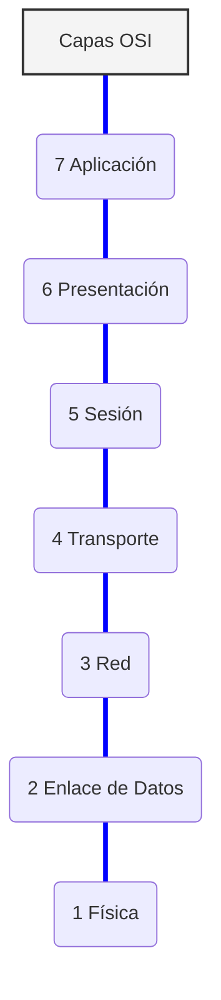
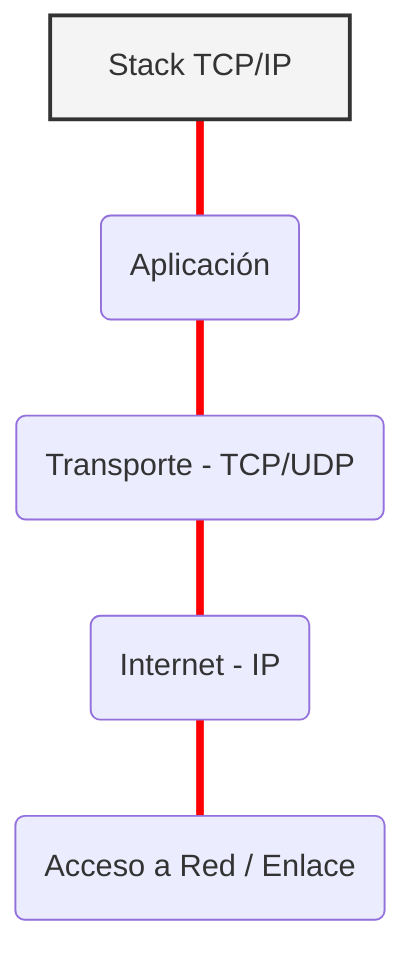
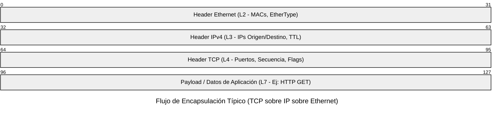

¡Hola mundo! Aquí Richard de nuevo 

¿Alguna vez te has preguntado cómo un simple "clic" cruza océanos de fibra óptica? Hoy nos ponemos el casco de ingeniero para hablar de los planos arquitectónicos de Internet: OSI y TCP/IP. 🤓

Vamos a simplificarlo sin perder rigor técnico.

## Los Arquitectos de la Red

Imagina que OSI (Open Systems Interconnection) es el modelo teórico perfecto, un estándar de jure de 7 capas prístinas. Es académico, granular y separa obsesivamente funciones como "Sesión" y "Presentación".

Por otro lado, TCP/IP es el modelo de facto, el que realmente construyó Internet. Es más pragmático, condensando esas 7 capas en un stack robusto de 4 (o 5, según a quién preguntes) capas.

La magia ocurre mediante la encapsulación. Cuando envías datos, estos descienden por el stack. Cada capa añade su propio header (cabecera) y, a veces, un trailer a la PDU (Protocol Data Unit) de la capa anterior, como si fueran muñecas matrioskas digitales, hasta convertirse en bits listos para el medio físico.

## Las "Antenas" del Conocimiento 📡
Aquí tenéis una representación visual de ambos stacks. Observad cómo TCP/IP es una versión más compacta y funcional de la teoría de OSI.

### Modelo OSI (El Teórico)

### Modelo TCP/IP (El Pragmático)

</pre>

## Anatomía de un Paquete 📦
Para visualizar la encapsulación, miremos dentro de un paquete típico que viaja por tu red (por ejemplo, cuando visitas una web).

El diagrama a continuación muestra cómo tus datos útiles (Payload) están envueltos secuencialmente por las cabeceras de Transporte (TCP), Red (IP) y finalmente Enlace (Ethernet) antes de salir al cable.

En resumen: OSI nos enseñó a pensar en redes de forma estructurada, pero TCP/IP es el caballo de batalla que hace que el mundo siga conectado. 

¡Hasta la próxima trama! 🚀
