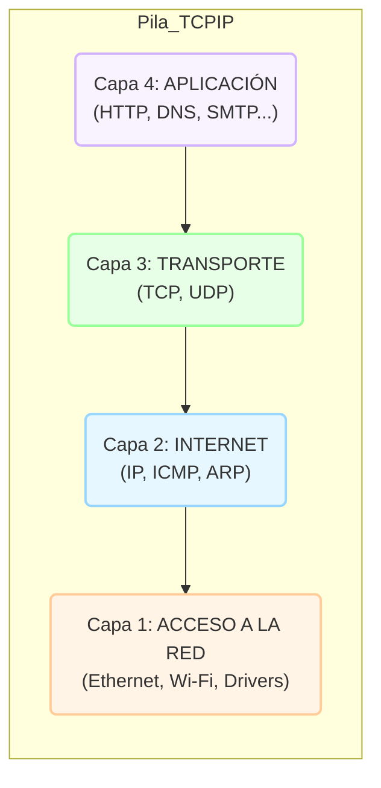

# Está es mi nueva wiki desde el móvil

```mermaid
graph TD
    classDef app fill:#f9f2ff,stroke:#d1b3ff,stroke-width:2px,color:#333;
    classDef trans fill:#e6ffe6,stroke:#99ff99,stroke-width:2px,color:#333;
    classDef internet fill:#e6f7ff,stroke:#99d6ff,stroke-width:2px,color:#333;
    classDef access fill:#fff4e6,stroke:#ffcc99,stroke-width:2px,color:#333;

    subgraph Pila_TCPIP
        direction TB
        L4("Capa 4: APLICACIÓN<br>(HTTP, DNS, SMTP...)"):::app
        L3("Capa 3: TRANSPORTE<br>(TCP, UDP)"):::trans
        L2("Capa 2: INTERNET<br>(IP, ICMP, ARP)"):::internet
        L1("Capa 1: ACCESO A LA RED<br>(Ethernet, Wi-Fi, Drivers)"):::access
        
        L4 --> L3
        L3 --> L2
        L2 --> L1
    end
```
