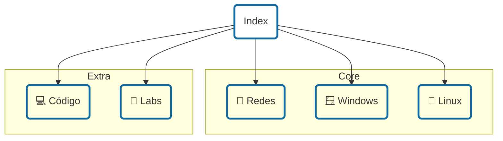

# 🧠 Mi Cerebro Digital

Bienvenido. Aquí documento mis aprendizajes sobre redes, código y sistemas.

### 🗺️ Mapa de Navegación

```mermaid
graph TD
    %% Estilo Universal "Contorno"
    classDef estandar fill:none,stroke:#106ba3,stroke-width:3px;
    
    Center(Index):::estandar
    
    subgraph Core
      Net(📡 Redes):::estandar
      Sys(🪟 Windows):::estandar
      Win(🐧 Linux):::estandar
    end
    
    subgraph Extra
      Dev(💻 Código):::estandar
      Lab(🧪 Labs):::estandar
    end

    Center --> Net
    Center --> Sys
    Center --> Win
    Center --> Dev
    Center --> Lab
```